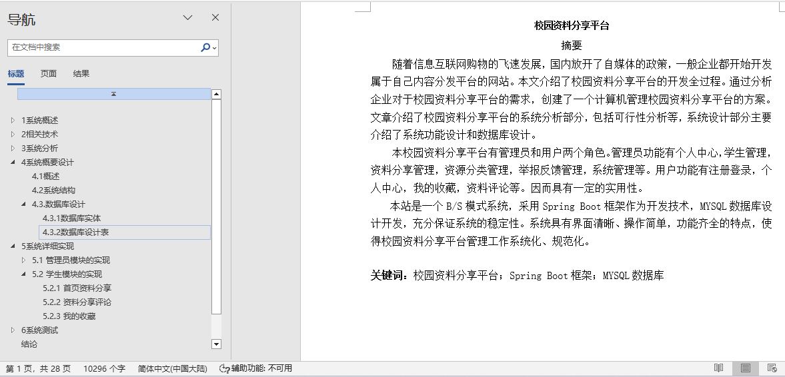
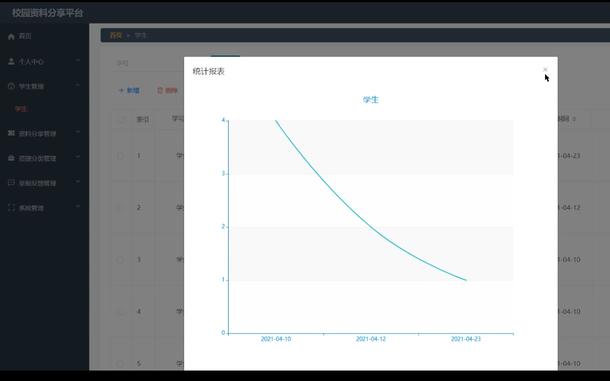
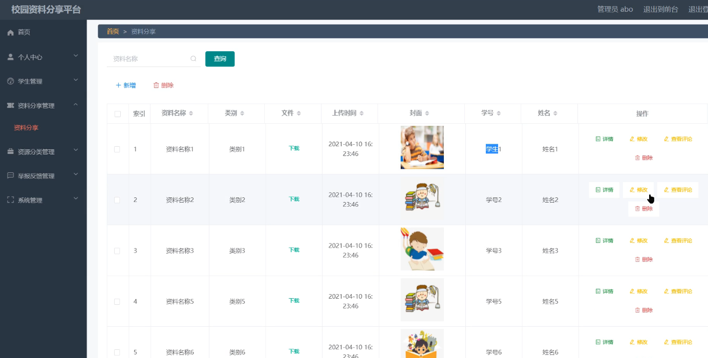
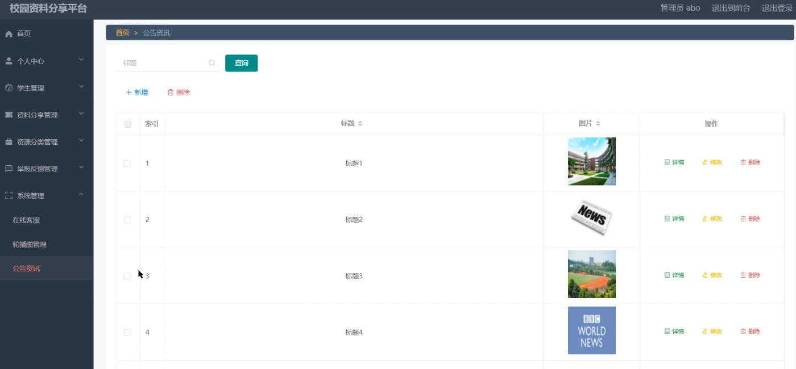
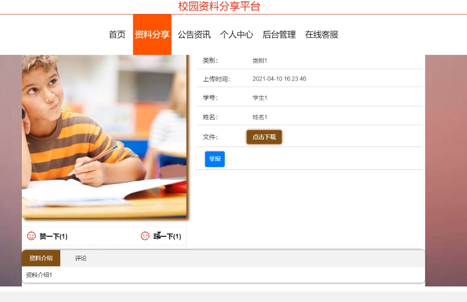
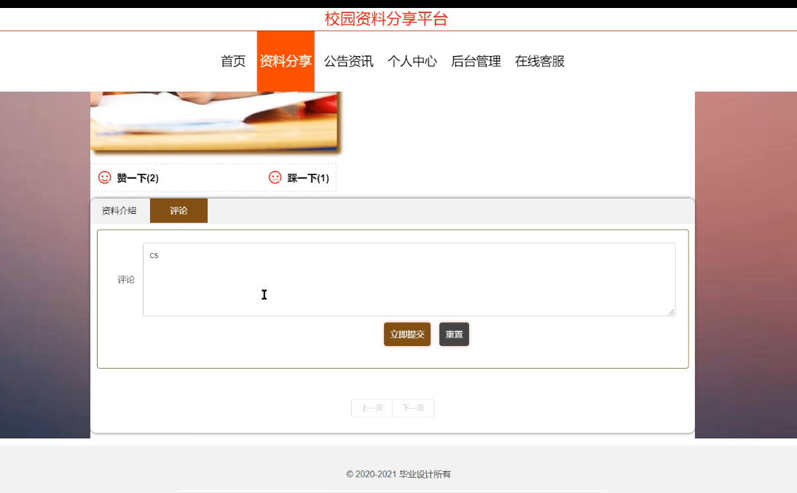
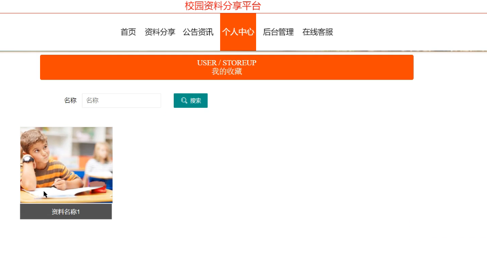
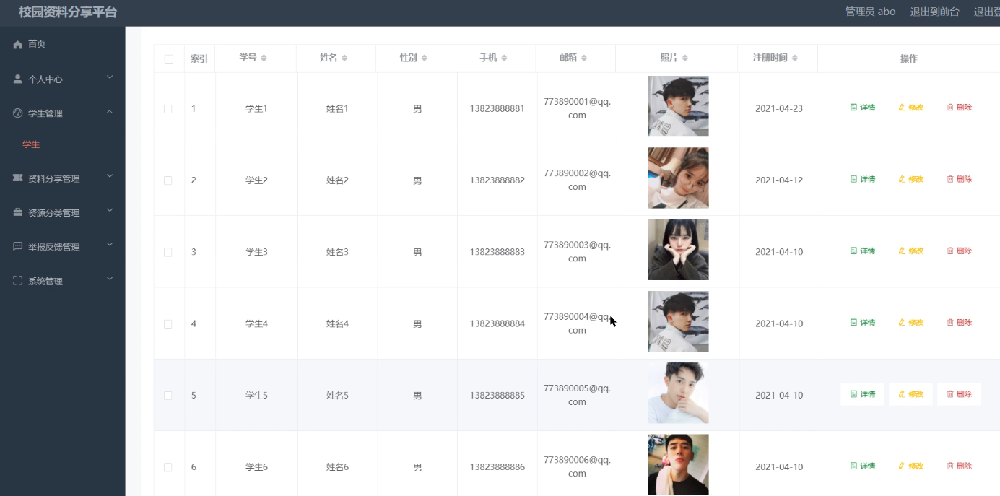

## 校园资料分享平台(程序+报告)

###  获取sql数据库文件: 从戎源码网 (https://armycodes.com/) QQ: 386869957 QQ群: 377586148
###  所有系统地址: (https://github.com/YuLin-Coder/AllProjectCatalog) 
###  所有项目以及源代码本人均调试运行无问题 可支持远程安装部署调试、定制修改、代码讲解

## 项目介绍
校园资料分享平台，系统包含两种角色：用户、管理员，系统分为前台和后台两大模块，主要功能如下：

1 管理员模块的实现

- 学生信息管理: 管理员可以对学生信息进行添加、修改和删除操作。

- 学生统计管理: 管理员可以对学生数据进行统计和分析。

- 资料分享管理: 管理员可以对资料分享信息进行添加、修改和删除操作。

- 公告资讯管理: 管理员可以对公告资讯进行添加、修改和删除操作。

2 学生模块的实现

- 首页资料分享: 学生登录后可以在首页查看资料分享内容。

- 资料分享评论: 学生可以对资料分享进行评论操作。

- 我的收藏: 学生可以在个人中心查看自己收藏的资料信息。

## 项目技术
- 编程语言：Java
- 数据库：MySQL
- 项目管理工具：Maven
- 前端技术：HTML、CSS、JavaScript、Vue
- 后端技术：Spring、SpringMVC、MyBatis

## 运行环境
- JDK版本：JDK1.8及以上
- 开发工具：IDEA、Ecplise、Myecplise都可以
- 数据库: MySQL5.7及以上
- Maven：maven3.0及以上
- Node：14.14.0及以上

## 运行截图

